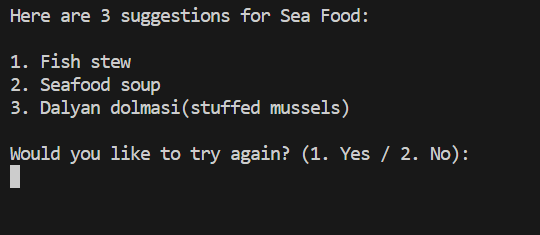

# FOOD FINDER ...

In this terminal based app, the user answers questions and at the end gets 3 food suggestions based on the user preferences.

This project was built with Python as the "Python's Essentials" Project (portfolio project 3) for Code Insitute.(with CI template)

[Link to live site](https://food-finder123-d49d8309cda0.herokuapp.com/)


## Index - Table of Contents

- [Planning](#planning)

- [Design](#design)

- [UX](#ux)
    - [Programm Goals](#programm-goals)
    - [User Stories](#user-stories)

- [Features](#features)
    - [Existing Features](#existing-features)
    - [Future Features](#possible-future-features)

- [Data Model](#data-model)

- [Testing](#testing)
    - [Validator Testing](#validator-testing)
    - [Browser Testing](#browser-testing)
    - [Testing User Stories](#testing-user-stories-functionality)

- [Debugging](#debugging)
    - [Fixed bugs](#fixed-bugs)
    - [Unfixed bugs](#unfixed-bugs)

- [Deployment](#deployment)

- [Credits](#credits)
    - [Data](#data)
    - [Code](#code)
    - [Styling](#styling)


## Planning

The following flowchart (created with [daigrams.net](https://app.diagrams.net/)) visualizes the planning process for this application.


## Design

The design process for the user interface was limited.

Error messages are displayed to guide user to enter valid inputs.

Questions are displayed in a cleared console to make the interface better visually.

Used 2 options for user to check the instructions or begin directly.

## UX

### Programm Goals

The goal of this programm is to provide the user with a simple and easy way of food suggestions.

### User Stories

**As a user I want to**

- be able to check the instructions when first loading the programm
- check the instructions of the app in short and simple text
- be informed if my data input is not valid
- be able to restart the app or not when after it's finished
- be able to see several food subcategories as options
- get at least a few suggestions at the end based on my answers

**As a site administrator I want to**

- be able to make modifications to the app
- be able to suggest many more food options to user
- be able to suggest foods based on protein and carbohydrate needs
- be able to add more cuisines


## Features

### Existing Features

**Logo**
- Displays app title using ASCII


**Welcome Screen**
- Displayed the options to the user for starting the app or seeing the instructions


**Instructions**
- Gives the user a information through the app and how to use it


**food options**
- Allows user to choose different types of foods


**Invalid Data Error**
- Informs the user if input data was not valid
- Tells the user which data type is required and what was typed incorrectly
- Displays errors for invalid inputs


**Food suggestions**
- Displays 3 food suggestions at the end
- Suggestions are based on the user preferences


**Simple Interface**
- Instead of polluted console like this:


- Used a simple design to display all the questions in a cleared console


- Also errors are displayed under the questions instead of a cleared console to avoid the user having to remember the question after getting an error


**Restart the app option**
- Offers user the choice to try again after finishing all the questions




### Possible Future Features

**Food Icons**
- Will add food icons for a better user interface visuals

**Ingredients based suggestions**
- Will add a function to suggest foods based on ingredients data entered by user.

## Data Model

**Data Validation**

- The `get_choice()` function ensures data validation by prompting the user to make a choice from a given set of options. It repeatedly prompts the user until a valid choice is made, preventing invalid inputs.

**Function Flow**

- `start_app():`;
This function initiates the application and displays the introductory message.
It prompts the user to select an option to either begin answering questions or view instructions.

- `get_user_preferences(suggestions)`;
This function guides the user through selecting their preferred cuisine and dietary type.
It calls `get_choice()` to prompt the user for input and `get_base_preferences()` to retrieve base preferences.

- `get_base_preferences(suggestions, cuisine, food_type):`;
This function retrieves base preferences based on the selected cuisine and dietary type.
It calls `get_suggestions()` to retrieve specific food suggestions for the selected base type.

- `get_suggestions(suggestions, cuisine, food_type, base_type):`;
This function fetches specific food suggestions based on the selected cuisine, dietary type, and base type.

**Assigning the Classes to Functions**

Each function in the codebase serves a specific purpose:

- `get_choice():`: Handles user input for selecting options.
- `get_user_preferences():`: Guides the user through selecting cuisine and dietary preferences.
- `get_base_preferences():`: Retrieves base preferences based on cuisine and dietary type.
- `get_suggestions():`: Fetches specific food suggestions based on cuisine, dietary type, and base type.

**Interaction with the Suggestions Dictionary**

- The suggestions dictionary holds the data model, organizing food suggestions by cuisine, dietary preferences, base types, and specific dishes.
- Functions like `get_user_preferences()`, `get_base_preferences()`, and `get_suggestions()` interact with this dictionary to retrieve relevant information based on user selections.

**Error Handling**

- The functions incorporate error handling mechanisms to ensure smooth user interactions and prevent crashes due to invalid inputs.
- Invalid choices prompt the user to enter a valid option until correct input is provided, enhancing the user experience and application robustness.

**Overall Functionality**

- The combined functionality of these functions allows the application to guide users through selecting their preferred cuisine, dietary type, and specific dish preferences, ultimately providing personalized food suggestions based on their inputs.

## Testing

### Validator Testing

- HTML, CSS and JavaScript validation does not apply to this project. The template provided by Code Institute as provided to all students is assumed to be tested for the above.
No further change or manipulation of the template's default HTML, CSS and JavaScript files has been performed.

- Python Validator [CI Python Linter](https://pep8ci.herokuapp.com/)

- **Errors**


- **After fixes**

No further errors or warnings.


- Performance, Accessibility, SEO, Best Practices (Lighthouse Chrome DevTools)


### Browser Testing

Ensuring all parts of the programm function as expected in all major browsers.

| Browser     | Layout      | Functionality |
| :---------: | :----------:| :-----------: |
| Chrome      | ✔          | ✔             |
| Edge        | ✔          | ✔             |
| Firefox     | ✔          | ✔             |


### Testing User Stories (Functionality)

| Expectation (As a user, I want to...)  | Result (As a user, I...)    |
| :---------------------------------: | :------------------------------:|
| be able to check the instructions when first loading the program | see the instructions when first loading the program |
| check the instructions of the app in short and simple text | see the instructions with a very simple design |
| be informed if my data input is not valid | see an error message after I input invalid data, telling me what data type is required |
| be able to restart the app or not when after it's finished | can choose to restart the app after finishing |
| be able to see several food subcategories as options | see several food categories as an option |
| get at least a few suggestions at the end based on my answers | see 3 food suggestions at the end |


## Debugging

### Fixed Bugs

**Formatting**

To guarantee consistent line breaks, whitespaces and indentation, run.py was formatted by me completely manually by checking the erros by using:

[CI Python Linter](https://pep8ci.herokuapp.com/)

**Bugs**

- After choosing the Non-Vegetarian category app displays chicken subcategory question instead of sea food when user press 1.


*Solution*:


- Can't reach the food types to display next related question.


*Solution*:

Added changes to suggestions list to make it reachable by my functions.


- Can't display error after adding `clear_screen()` function


*Solution*:

Fixed the bug by deleting the second `clear_screen()` function


- Can't display error and moves to questions even if user press 2 for no.


*Solution*:

Fixed the bug by adding exit() after 2 input.


### Unfixed Bugs

No unfixed bugs to date.

## Deployment

This project was deployed with Heroku using Code Institute's mock terminal as provided with the Python Essentials template.

To deploy:

- Clone or fork this public repository
- Create a Heroku account
- Create a new app with Heroku
- In **Settings**, add 2 buildpacks:
    - ```Python```
    - ```NodeJS```
    
    Ensure the buildpacks are created in that order!

- Allowing Heroku access to GitHub, link the new app to the relevant repository
- Choose whether or not to enable **Automatic Deploys**. If enabled, the deployed app will update automatically with each push to GitHub
- Click **Deploy**

## Credits

### Data

- **Food List**

    [Foods](https://www.bbcgoodfood.com/)

    [Foods-2](https://www.taste.com.au/)

I created my food suggestions list by using these two websites.

- **Logo**:

I created my ASCII logo by using:

[Text to ASCII Art Generator](https://patorjk.com/software/taag/#p=display&f=Graffiti&t=Type%20Something%20)

    
### Code

- **Template and Terminal**

    [Python Essentials Template](https://github.com/Code-Institute-Org/python-essentials-template) provided by Code Institute 

- **Food Finder**

I used these tutorials to improve my Python understanding of;
- creating lists of list,
- arguments and parameters,
- data types,
- user inputs,
- loops,
- dictionaries and sets,
- f strings,
- classes and objects,
- functions

Didn't use any specific code by adopting from any tutorials or google.

- [Tutorial by Dave Gray](https://www.youtube.com/watch?v=qwAFL1597eM&t=14507s)

- [Tutorial by Caleb Curry](https://www.youtube.com/watch?v=i_ZEaE5vfE0)

- [Tutorial by Caleb Curry](https://www.youtube.com/watch?v=jE0nVl8iTFI&t=118s)

- `clear_screen():` [DelftStack](https://www.delftstack.com/howto/python/python-clear-console/)

- Am I Responsive 

Am I Responsive screenshots are captured by downloading Ignore X-Frame.

[Ignore X-Frame](https://chromewebstore.google.com/detail/ignore-x-frame-headers/gleekbfjekiniecknbkamfmkohkpodhe)
